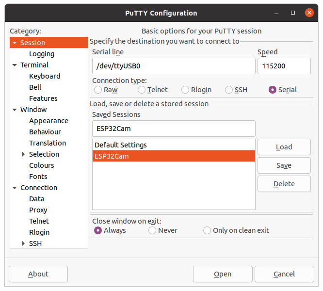

# 如何在 esp32-cam 模块中使用 micropython

使用的工具：
- [固件](https://github.com/lemariva/uPyCam)
- esptool.py
- putty

## 1. 安装esptool工具
> `sudo pip install esptool`

## 2. 刷固件
首先得把固件刷到esp32cam板子中去。

- GPIO0接0v

- 然后按一下重启键


然后分别执行一下命令来清除flash和刷入新的固件，注意两个命令中间还得按一下重启键。

```
esptool.py --chip esp32 --port /dev/ttyUSB0 erase_flash
esptool.py --chip esp32 --port /dev/ttyUSB0 --baud 460800 write_flash -z 0x1000 micropython_3a9d948_esp32_idf4.x_ble_camera.bin
```


然后尝试链接ttyUSB0端口，看到资料上说，可以通过ttyUSB0端口操作mcropython，到目前为止没有实际用过，结果死活连不上，不管是通过`vscode`中的`pymakr`还是`putty`，亦或`screen /dev/ttyUSB0`都是没有反应。后来`sudo screen /dev/ttyUSB0`乱码输出。才发现是普通用户没有使用tty的权限。

## 3. 解决普通用户无法访问/dev/ttyUSB0
```
ubuntu@ubuntu:~/$ stat /dev/ttyUSB0 
  File: /dev/ttyUSB0
  Size: 0         	Blocks: 0          IO Block: 4096   character special file
Device: 6h/6d	Inode: 528         Links: 1     Device type: bc,0
Access: (0660/crw-rw----)  Uid: (    0/    root)   Gid: (   20/ dialout)
Access: 2021-03-27 23:19:52.375257192 +0100
Modify: 2021-03-27 23:19:00.375257192 +0100
Change: 2021-03-27 23:11:23.375257192 +0100
 Birth: -
```
表明只有用户组`Gid: (   20/ dialout)`才能使用`ttyUSB0`.


将当前用户添加到`dialout`组中：

```ubuntu@ubuntu:~/$ sudo usermod -a -G dialout $USER```

重启
## 4. 使用putty操作REPL



### 参考链接
[Tutorial: Getting Started with MicroPython on ESP32, M5Stack, and ESP8266](https://lemariva.com/blog/2020/03/tutorial-getting-started-micropython-v20)
