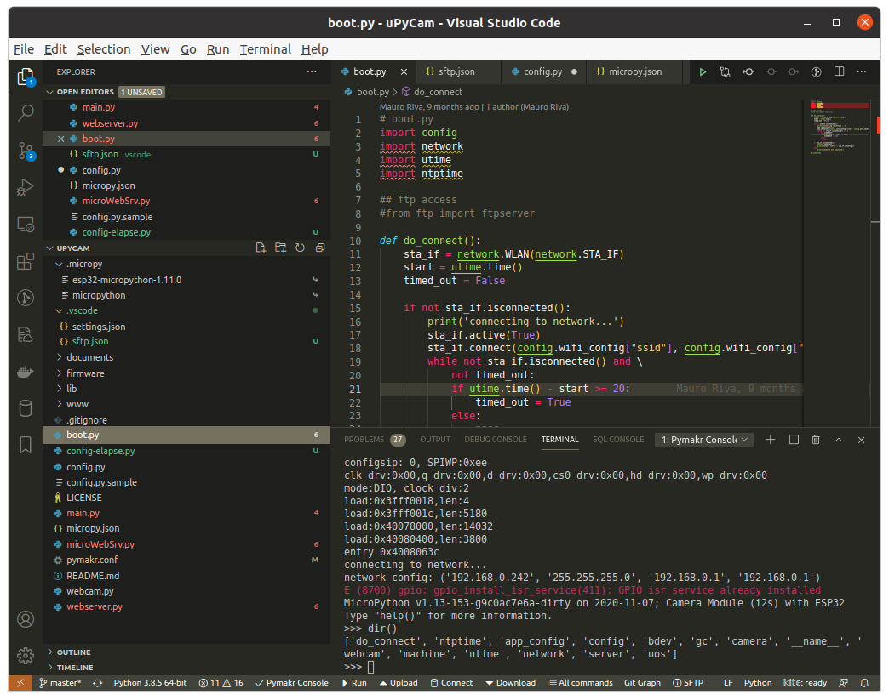

# 实战项目

## 刷好固件之后简单三步：
1. 克隆项目
>`git clone -b timelapse-camera https://github.com/lemariva/uPyCam.git`

2. 设置wifi密码
```pytho
# wlan access
ssid_ = ""
wpa2_pass = ""
```
3. 通过`pymakr`将项目上传到`esp32-cam`


> 提示：点击最底部的工具栏的`pymakr-console`可以重新断开和链接`esp32-cam`


## 配置示例

```python
app_config = {
    'sleep-ms': 2000,
    'max-error': 10,
    'ftp': True,
    'mode': 'microSD', # mode -> 'MQTT' or 'microSD'
    'camera': 'ESP32-CAM',  # camera -> 'ESP32-CAM' or 'M5CAMERA'
    'led': 4, # led -> 4: ESP32-CAM or 14: M5CAMERA
}

mqtt_config = {
    'server': '192.168.178.147',
    'client_id': 'esp32-camera',
    'topic': b'Image'
}

microsd_config = {
    'miso':2,
    'mosi':15,
    'ss':13,
    'sck':14,
}


wifi_config = {
    'ssid':'xxx',
    'password':'xxxxxxx'
}

```

[#MicroPython: Portable time-lapse camera using an ESP32-CAM](https://lemariva.com/blog/2020/02/micropython-timelapse-video-using-esp32-cam)